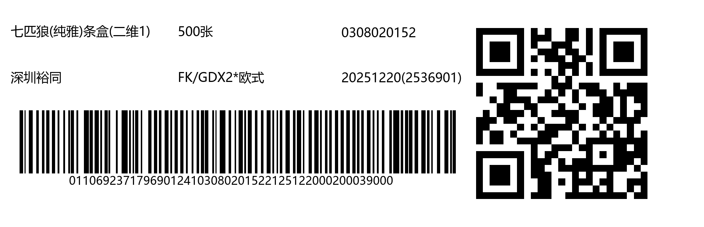

## 介绍

批量生成条形码

毕设用于作假使用的

## 用法

### 修改图片数据

按照`data.json`的格式来编辑条形码/二维码的元数据

```json
 {
    "category_id": 1,
    "data": "011069237179690124103080201522125122000200046000",
    "fields": {
      "quantity": "500张",
      "auxiliary_code": "0308020152",
      "company": "深圳裕同",
      "model": "FK/GDX2*欧式",
      "production_date": "20251220(2536901)"
    }
  },
```

`category_id`对应的类别名可在`main.py`中的字典`CATEGORY_NAMES`修改。

> 注意，fields里面各个字段的顺序决定了图片中的顺序
>
> 例如：如果auxiliary_code和company换了位置，那么auxiliary_code的位置会和company对换
>
> ---
>
> 2026/7/3 15:50更新
>
> 我艹我在说什么，是auxiliary_code和company在json中换了位置，那么在图片中的位置也会互换

### 修改图片各元素的位置

在`main.py`中，可修改`class Config`内的成员来修改各个元素的位置和大小。

例如

```python
    image_width: int = 1980
    image_height: int = 640
```

### 运行

需要事先下载`uv`,可以参考[uv中文文档](https://uv.doczh.com/getting-started/installation/)

执行下面命令即可

```bash
uv run ./main.py
```

图片保存在`./output`中

## 效果


